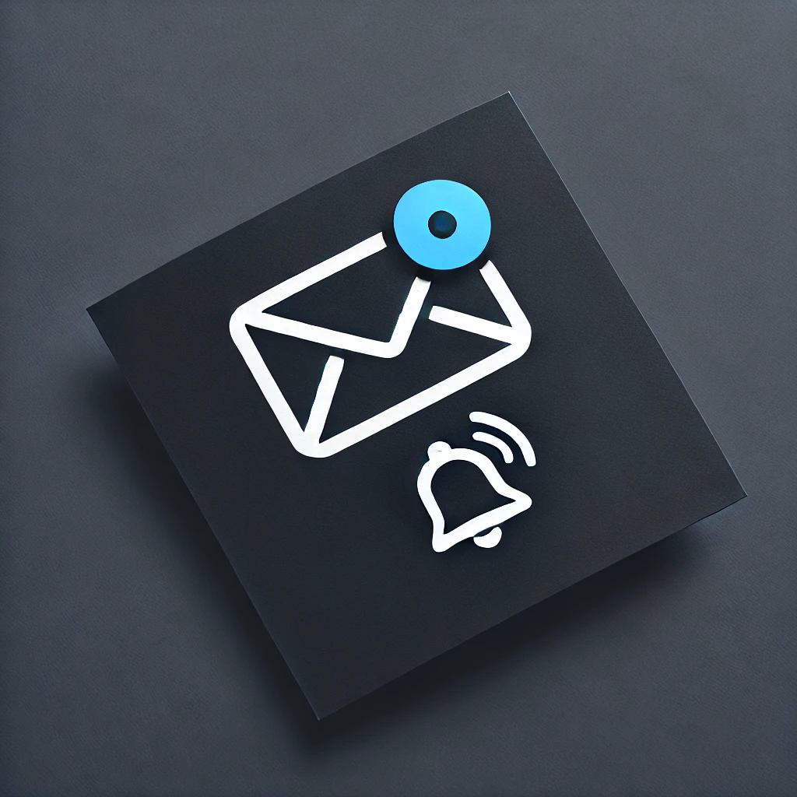

# Telegram Notifier Bot



Welcome to the Telegram Notifier Bot repository! This bot is written in Python and uses SQLite database to provide users with the ability to set their own notifications and receive alerts from the bot.

## How to Use

1. Find the bot on Telegram: [@notifier8bot](https://t.me/notifier8bot)

2. Start a chat with the bot and follow the instructions to configure your notifications.

3. Add the time and text for the notifications you want to receive.

4. Receive your notifications on time!

## Features

- **Custom Notifications**: You can add, modify, and delete notifications using bot commands.

- **Flexible Settings**: The bot allows you to set notifications for specific days of the week and repeat them at specified time intervals.

- **Time Zone**: You can specify your time zone to receive accurate notifications.

## Used Technologies

The project is developed using the following technologies:

- **Python:** Programming and development are carried out using the Python programming language.

- **aiogram:** The aiogram framework for creating Telegram bots.

- **PostgreSQL:** PostgreSQL is utilized as a relational database for storing and managing data.

- **Docker:** The project is containerized using Docker, providing isolated and lightweight deployment.

- **Redis:** Redis is employed for caching and managing the project's state, providing a high-performance, in-memory data store.

These technologies were chosen to ensure efficient and convenient development, as well as to provide stability and scalability for the application.

## Installation Guide

### Local Installation

1. Clone the repository to your local machine:

   ```bash
   git clone https://github.com/say8hi/tg_bot_notifier.git
2. Navigate to the project directory:

    ```bash
   cd tg_bot_notifier
   
3. Create a .env file with the following content:
    
   ```env
   # Tg bot
    BOT_TOKEN=your_telegram_bot_token
    ADMINS=your_admin_telegram_user_id
    USE_REDIS=True

    # Postgres
    POSTGRES_DB=your_database_name
    POSTGRES_USER=your_database_user
    POSTGRES_PASSWORD=your_database_password
    POSTGRES_HOST=your_postgres_host
    
    # Redis
    REDIS_HOST=your_redis_host
    REDIS_PORT=your_redis_port
    REDIS_PASSWORD=your_redis_password
   
4. Install the required dependencies:
    ```bash
   pip install -r requirements.txt
   
5. Set up your PostgreSQL database and configure the connection in the .env file.

6. Configure your Redis server and update the .env file.
7. Run the bot:
    ```bash
   python bot.py
   
### Docker Compose Installation
1. Clone the repository to your server:
    ```bash
   git clone https://github.com/say8hi/tg_bot_notifier.git

2. Navigate to the project directory:
    ```bash
   cd tg_bot_notifier

3. Create a .env file with the same content as above.
4. Create and start the Docker containers:
    ```bash
   docker-compose up -d
### 5. Done!
